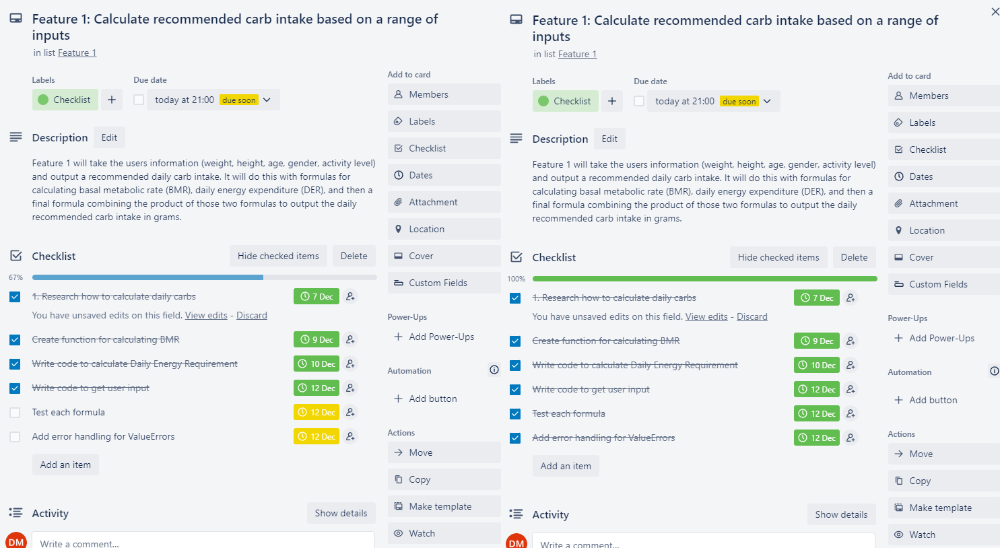
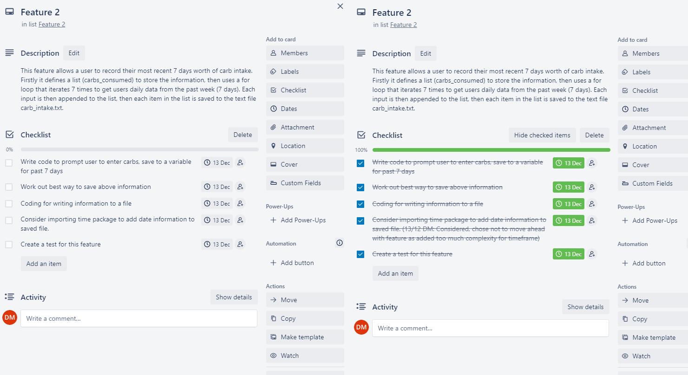
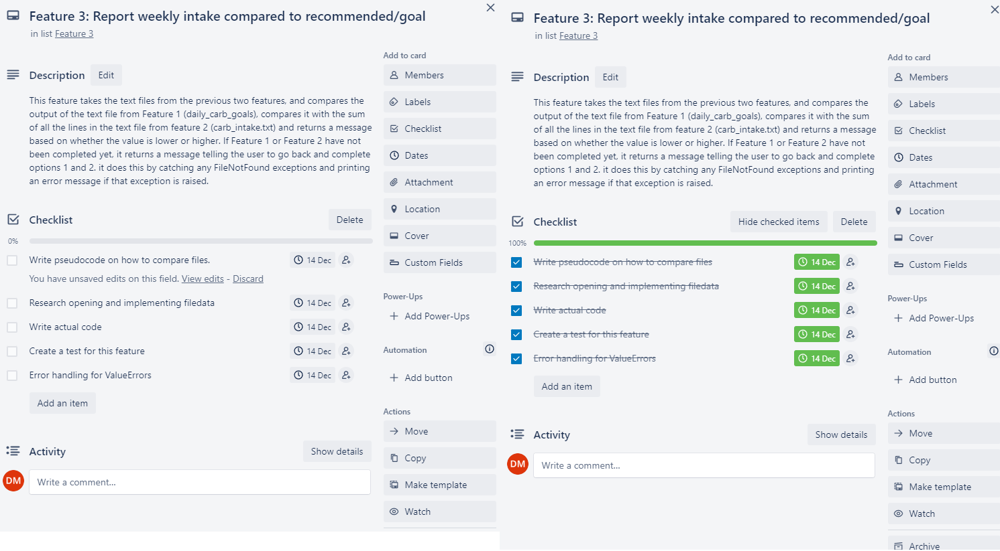

# David McArthur T1A3 - Terminal App Documentation

Video Presentation*:
<https://www.loom.com/share/fc0a0f92601442e5b346886aaffc41e4>

* Please accept my apologies for the wiggly cursor and the fast talking, I was nervous and trying to keep it under 10 mins.

## R1: Answers to all the documentation requirements below

## R2: Your README.md should have a separate heading for each documentation requirement and answers organised under the appropriate headings

## R3: Provide full attribution to referenced sources (where applicable)

### References

### Formula for calculating BMR + Daily Energy Requirement

Mifflin St Jeor equation: <https://reference.medscape.com/calculator/846/mifflin-st-jeor-equation>
  
### Formula for calculating carbs from Daily Energy Requirements

<https://healthyeating.sfgate.com/recommended-amount-percent-carbohydrates-per-day-7287.html>

### Menu inspired by cafe app in Jairo's Github

<https://github.com/JairoAussie/wd-2022-std2-cafe>

## R4 Provide a link to your source control repository

<https://github.com/dmac3000/t1a3>

## R5 Styling

This code adheres to PEP8 styling.
<https://peps.python.org/pep-0008/>

## R6 Features

## Description

The Carbulator app is intended for those wishing to calculate their ideal carbohydrate intake per day (primarily for weight loss), and compare it with their actual intake.

Ideal carb intake is calculated by getting the users height, weight, age, biological gender and activity level, then calculating their BMR (Basal Metabolic Rate) which is the minimum amount their body needs to survive when doing nothing at all. We then use multiplier based on their activity level to calculate their daily recommened calorie intake. From there, we can work out their carb intake if we assume the user wants to get 40% of their calories from carbs, which is the standard figure for a weight loss goal.

### Menu

The menu allows the user to navigate the app with 3 menu options and an exit app function. If an invalid input It also clears the screen after completing a feature to keep the app tidy. Lastly, the app includes mention of the day and responds differently if it is a Monday, to add some personality to the app.

### Feature 1. Calculate recommended carb intake based on a range of inputs

Feature 1 is a function that will get users input (weight, height, age, gender, activity level) and output a recommended daily carb intake via two formulas

The first formula is based on the Mifflin-St Jeor Equation for calculating basal metabolic rate (BMR).

```py
bmr = 10 * weight + 6.25 * height - 5 * age + s
```

The above formula outputs the users basal metabolic rate in calories, which is the minimum amount of calories required for a person with those characteristics to function. The "s" modifier makes an adjustment for calories based on biological gender.

```py
 if gender == "male":
    s = 5
  elif gender == "female":
    s = -161
```

That information is run through the following other formula that acts as a multiplier for activity level. This formula uses conditional statements to determine which formula to run based on the activity level the user has input.

```py
  if activity_level == "1":
    der = bmr * 1.2
  elif activity_level == "2":
    der = bmr * 1.375
  elif activity_level == "3":
    der = bmr * 1.55
  elif activity_level == "4":
    der = bmr * 1.725
```

The last formula takes the daily energy requirement calculated above and runs it through a formula for calculating carb intake, assuming that the user wants to get 40% of their calorie intake from carbs which is the standard suggested amount for weight loss.
  
```py
  daily_carb_intake = der * 0.4 / 4
```

All of the above is wrapped up in a function called calc_carb_intake.

Once this function is defined, the program asks the user for their input, validates that input against the "validate_inputs" and "validate_gender" functions to catch any errors. It then calls the calc_carb_intake function to crunch the formulas and returns the data in the variable "daily_carb_intake" and writes it to a text file "daily_carb_goal.txt" as per the following:

```py
# Main program logic
while option != "4":
  clear_screen()
    # invoke print options and return the selected option
  option = print_options()
  clear_screen()
  if option == "1":
    # Run Feature 1: Get user input
    weight = input("Enter your weight in kilograms (kg): ")
    weight = validate_inputs(weight)
    height = input("Enter your height in centimetres (cm): ")
    height = validate_inputs(height)
    age = input("Enter your age in years: ")
    age = validate_inputs(age)
    gender = input("Enter your gender (male or female): ")
    gender = validate_gender(gender)
    activity_level = input("Enter your activity level - (1) sedentary (2) lightly active (3) moderately active or (4) very active: ")
    activity_level = validate_activity_levels(activity_level)

    # Calculate and print the daily carb intake based on above user input
    daily_carb_intake = calc_carb_intake(weight, height, age, gender, activity_level)
    # der = calc_carb_intake(der)
    # s = calc_carb_intake(s)
    # Write the daily_carb_intake number to the file, then close it 
    with open("daily_carb_goal.txt", "w") as f:
      f.write(str(daily_carb_intake))   
    # Output details for user to show function has executed correctly
    print("Your daily energy requirement is", int(der), "calories.")
    print("Your recommended daily carb intake is: ", int(daily_carb_intake), "g/day")
    input("press Enter to continue...")
    clear_screen()
    continue
```

Note that this code calls on another function "clear_screen" which clears the screen between menu options to keep the app tidy.

### Feature 2. Record and save actual daily carbs

This feature allows a user to record their most recent 7 days worth of carb intake. Firstly it defines a list (carbs_consumed) to store the information, then uses a for loop that iterates 7 times to get users daily data from the past week (7 days). Each input is then appended to the list, then each item in the list is saved to the text file carb_intake.txt.

```py
elif option == "2":
      # access function to track weekly intake, create new file for weekly intake.
      # def get_carb_intake():
      # Initialize an empty list to store the carb intake for each day
      carbs_consumed = []
    
        # Ask the user for their carb intake for each of the previous 7 days
      for i in range(7):
          # Prompt the user to enter their carb intake for a day
        intake = input(f"Enter your carb intake for day {i+1}: ")
        
        # Add the intake to the list
        carbs_consumed.append(intake)
    
        # Open a file in write mode
      with open("carb_intake.txt", "w") as f:
          # Write the carb intake for each day to the file, one day per line
        for intake in carbs_consumed:
          f.write(str(intake) + "\n")
```

### Feature 3. Report weekly intake compared to recommended/goal

This feature takes the text files from the previous two features, and compares the output of the text file from Feature 1 (daily_carb_goals), compares it with the sum of all the lines in the text file from feature 2 (carb_intake.txt) and returns a message based on whether the value is lower or higher. If Feature 1 or Feature 2 have not been completed yet, it returns a message telling the user to go back and complete options 1 and 2. it does this by catching any FileNotFound exceptions and printing an error message if that exception is raised.

Note: Ensure that your features above allow you to demonstrate your understanding of the following language elements and concepts:

* use of variables and the concept of variable scope
* loops and conditional control structures

## R7 Implementation Plan

I used Trello to break the project up into smaller tasks so I could track my progress, as per the following screenshots:

### Feature 1



### Feature 2



### Feature 3



## R8 Design help documentation which includes a set of instructions which accurately describe how to use and install the application

Documentation is included in the app folder as requirements.txt, contents are included below for convenience:

Welcome to Carbulator!

How to run this program:

1. Make sure Python is installed on your device. In MacOS/Linux, open a command prompt and type "which python". On Windows, type "python --version". If no version is present, install the latest version of Python by visiting https://www.python.org/downloads/ and clicking Download. Follow the prompts to install.
2. Open your command prompt (Windows) or bash screen (Linux/MacOS)
3. Navigate to the correct directory that you have saved carbulator.py by typing cd/directory/you/saved/carbulator/in
4. Run the script "run_carbulator.sh" in your command line. How to do this will be dependant on your operating system.

If using MacOS/Linux, input the following command:

```bash
./run_carbulator.sh
```

If running Windows, enter the following in command prompt:

```cmd
run_carbulator.sh
```

Inputting the above command and pressing enter should run the script to open the app. Enjoy!
